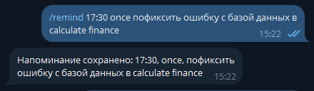
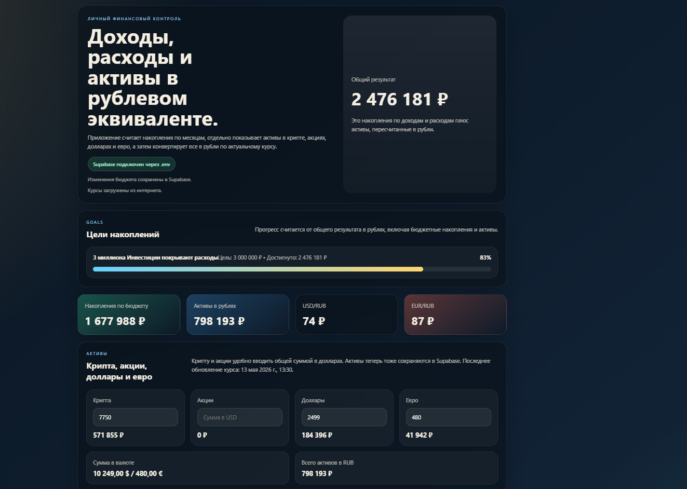
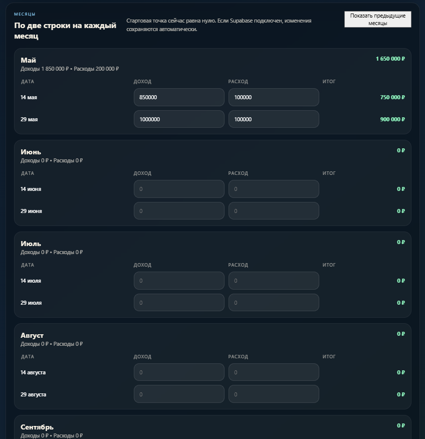
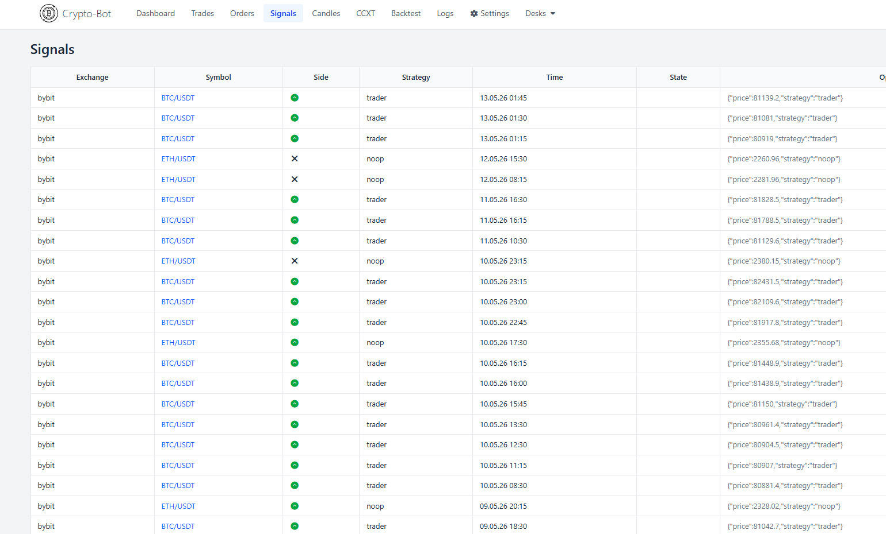
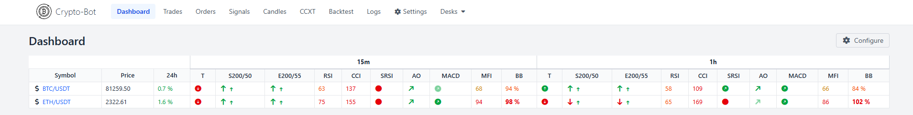

# Hi there 👋, I'm Vasilii

I'm a frontend developer focused on **React** and **TypeScript**.

I like building practical projects: web apps, dashboards, Telegram bots, automation tools, and small fullstack experiments.  
I also work as a **BIM Coordinator**, so I’m used to thinking about real business processes, not just code.

My goal is to build clean, useful, and maintainable products.

---

## What I'm working on

- React + TypeScript projects
- frontend architecture and **Feature-Sliced Design**
- performance, SSR, and render optimization
- testing with **Jest** and **Cypress**
- backend basics with **Node.js** and **Express**
- Telegram bots, dashboards, and automation tools
- cloud deployment with free and modern services

---

## Tech Stack

**Frontend:** React, TypeScript, JavaScript, Redux Toolkit, RTK Query  
**Styling:** SCSS, CSS Modules  
**Architecture:** Feature-Sliced Design  
**Testing:** Jest, Cypress  
**Backend:** Node.js, Express, REST API  
**Database:** Supabase  
**Deployment:** Vercel, Koyeb, Google Cloud, UptimeRobot  
**Tools:** Git, GitHub, npm, Docker basics, Webpack, Vite  

---

## Projects

### [big-react-app](https://github.com/vasiliy19-12-1997/big-react-app)

A large practice project where I work with real frontend architecture.

I use it to practice:

- Feature-Sliced Design
- TypeScript
- Webpack
- Redux Toolkit and RTK Query
- Storybook
- Jest and Cypress

This project helps me understand how scalable frontend apps are built and maintained.

---

### AtomBIM Site

### [atom-bim-site-new](https://atom-bim-site-new-877766054154.europe-west1.run.app/)

A new corporate website built with **React, TypeScript, and Express**.

This project connects my frontend skills with my BIM background.  
I work on UI, app structure, backend integration, and features for displaying BIM instructions and internal documentation.

---

### Telegram Chat Bot

  

A Telegram bot built with **TypeScript**, **Node.js**, **grammY**, and **Express**.

I deployed it on **Koyeb**, connected **Supabase** for data storage, and used **UptimeRobot** to keep it available on free hosting.

This project helped me practice backend logic, API integration, deployment, and real service maintenance.

---

### Finance Tracker

  
  

A personal finance app for tracking income, expenses, assets, and financial goals.

Built with **React** and **Supabase**.  
I use it for real personal finance tracking, so it helps me think more like a product developer.

---

### Crypto Trading Bot Experiment
### [crypto-trading-bot](http://34.13.162.136:55555/)

  
  

A crypto trading bot experiment based on an open-source project fork.

I deployed it on **Google Cloud** using free trial infrastructure and tested it with a demo trading account.

In this project, I worked with Docker, exchange API configuration, strategy testing, Telegram notifications, and a web dashboard.

---

## How I learn

I like learning by building real things.

For me, a project is not finished when it only works locally.  
I try to deploy it, connect real services, test it, and improve it step by step.

I also like using free and modern cloud tools because they help me learn deployment and infrastructure without unnecessary costs.

---

## NPM

- [npm-profile](https://www.npmjs.com/~steelguard)

---

## Interests

- frontend development
- software architecture
- UI performance
- automation
- BIM and construction digitalization
- personal finance
- investments
- traveling

---

## Contacts

- Email: [49.changer_tole@icloud.com](mailto:49.changer_tole@icloud.com)
- Telegram: [@kebab_case304_8](https://t.me/kebab_case304_8)

  

